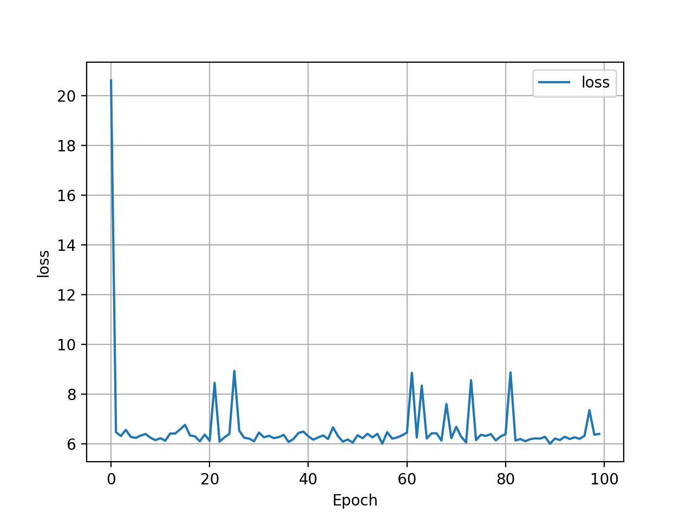
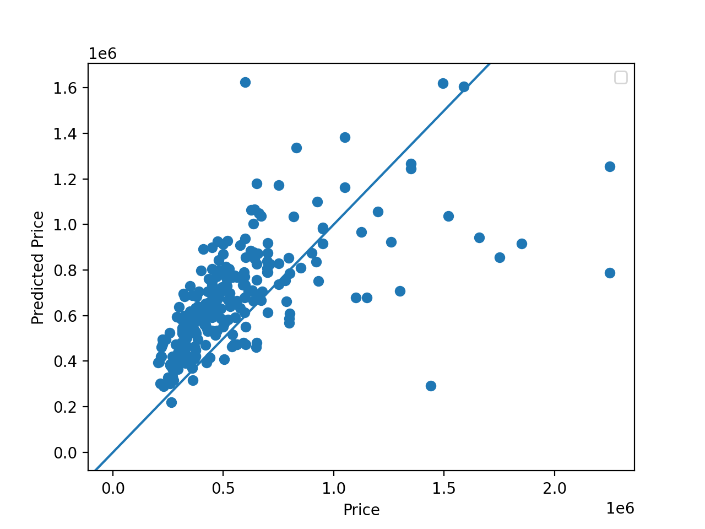
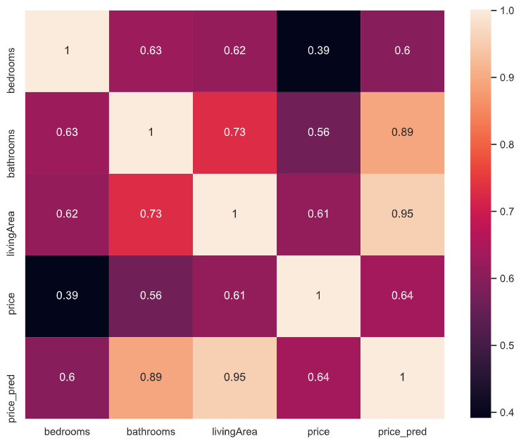
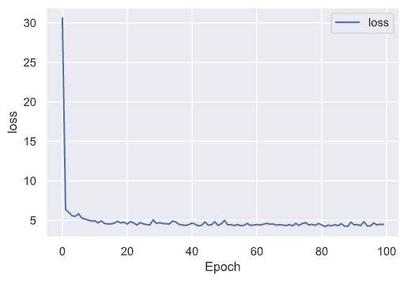
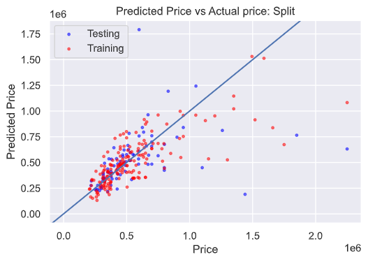
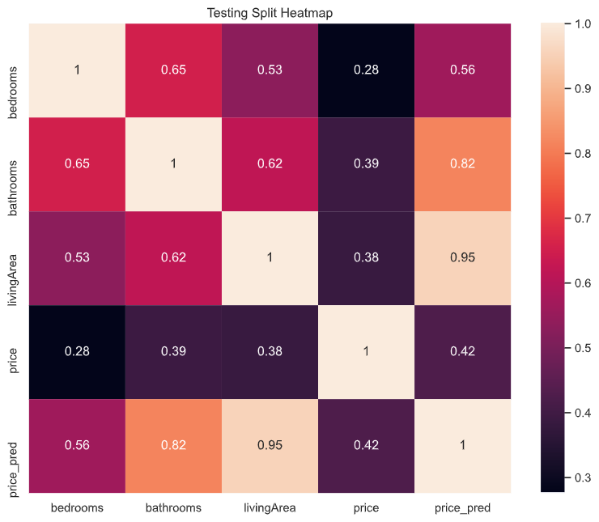

# Project 1 

## How did the model fare?

The model performed decently, but has a lot of room for improvement. It narrowly predicts home values within the price range with lots of data, but has trouble with outliers. The model also seems to very quickly plateau, with its loss not changing much after an initial drop. 

As you can see of the graph of price vs predicted price, the model performs relatively well in the range of prices with a lot of data available. It does tend to over predict home values, however. I think this is due to the fact that higher priced outliers effect the data. 

When running a similistic correlation on the data, the Living Area appears to be the most significant predictor, with bathrooms being closely behind. The price and predicted price have a correlation of around .64. While this is honestly lower than I would have wanted, the variables used to predict it only correlate so much to begin with. Based on the correlation between predicted price and living area being so high, I suspect the model heavily relied on it to get it's predictions. 

## Splitting the data

I also ran it again, but this time used a test/train split. The MSE of the training data was 4.39, and the MSE of the testing data was 10.25. Strangely, the split data seems to have a much more consistent downards MSE/loss trend graph. 

 

The Distributions of both of them also seem to be overestimate the price less than the unsplit dataset, although still appears to slightly overestimated. The most accurate predictions are in the lowest housing prices, and it spreads out more and more as the price increases. 

The correlation on the testing split is significantly less, only.42. It also is still extremely correlated with living area, supporting my hypothesis that it is the most important predictor variable. Overall, This model has room for much improvement. First off, it needs more and better input data. The dataset is relatively small, and subsets of the data (such as higher priced homes) are especially lacking in quantity, leading to poor results. 

