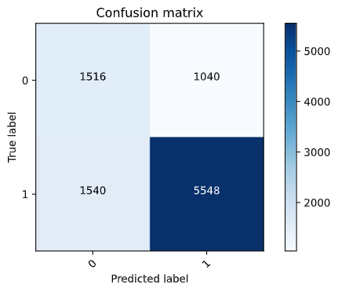
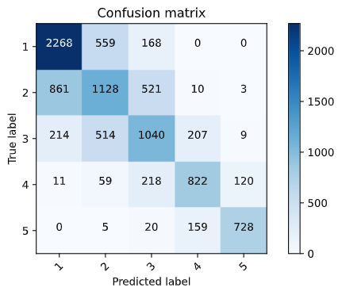
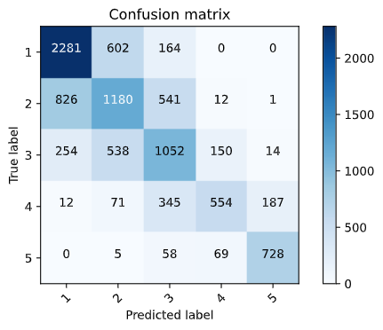
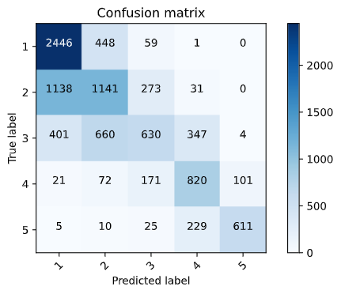

### Best and Worst Models 

So for the intial setup I had the following features in feature columns: 

- Size and education in numeric columns
- Location, potable, toilet, electric, car, cook, and gender in categorical columns 
- Age in bucketized columns [20, 40, 60]

The best model was with the binary model targeting income 5, with an accuracy of 0.97. The Confusion Matrix is below: 


The worst model was the binary model targeting income 2, with an accuracy of 0.73. The Confusion Matrix is below: 



These confusion matricies only show binary yes/no answers, but they are still useful.  The first one is far more accurate, with most being classified correctly, and a small and pretty even number being false negatives and positives. The model targeting class 2 is decently accurate, but really not all that great. There also also far more false negatives than false positives, interestingly. 

### Categorical model 

First, I set the same feature columns as before, but with a categorical model instead. It had an accuracy of 0.62. Here is the confusion matrix: 



Overall, the results are decent, but could definitely be improved. Most of the inaccuarate results still appear to be relatively close to the mark, meaning it might just require some tweaking to get a better accuracy. 



Next, I bucketized toilet. I did this by splitting it into three main categories, defined below: 

```python
cols1 = ['Flush to pit latrine', 'Flush to piped sewer system','Flush to somewhere else','Flush to septic tank', "Flush, don't know where"]
cols2= ['Ventilated Improved Pit latrine (VIP)', 'Pit latrine without slab/open pit', 'Pit latrine with slab']
cols3 = ['No facility/bush/field','99','Hanging toilet/latrine', 'Composting toilet','Bucket toilet','Other', ]
```

Column 1 was assigned the value 0, cols2 with 1, etc. The final accuracy was .60, which was actually lower than the original. This is pretty surprising, maybe the specific types of toilets were somewhat relevant to the model? 

After that I tried to bucketize potable water sources as well, into the following columns, numbered the same as before: 

```python
cols1 = ['Piped into dwelling', 'Piped to yard/plot', 'Public tap/standpipe']#,'Flush to somewhere else','Flush to septic tank', "Flush, don't know where"]
cols2 = ['Tube well or borehole', 'Protected well', 'Unprotected well']#, 'Pit latrine without slab/open pit', 'Pit latrine with slab']
cols3 = ['Protected spring','Unprotected spring','River/dam/lake/ponds/stream/canal/irrigation channel', 'Rainwater']
cols4 = ['Tanker truck', 'Cart with small tank', 'Bottled water']
cols5 = ['99']
```

After running that model, I got an accuracy of .585, and the following confusion matrix: 



This model weirdly made it worse again, and i think it made it harder to decipher between the lower classes, with many 2's being predicted to be 1's.


### Conclusion 

This model was quite weird, and all the improvements I tried seemed to not be effective, all getting roughly a 60% accuracy rate. I'm not really sure what else to try, but these results are interesting. Maybe the neural network is good enough to be able to do what im attempting to do, but better? Not sure. Will be interesting to see other's responses. 