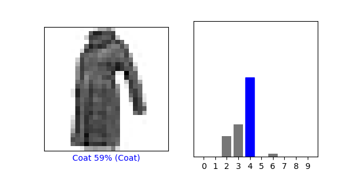
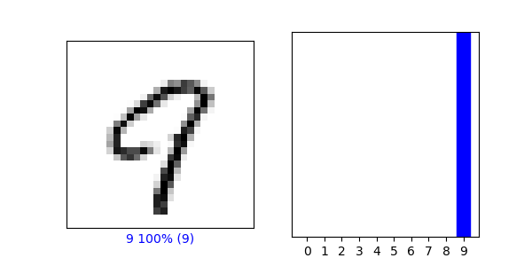

# Responses for today

## Clothing
  - Preprocess Images
    - 
  - Make Predictions 
    - Array
      ```
      $ predictions[820]
    
        array([3.0336094e-09, 1.3469431e-12, 3.7599630e-14, 1.8669140e-16,
               7.8254382e-12, 6.0902503e-06, 5.8999493e-11, 3.3189022e-04,
               4.8479142e-12, 9.9966204e-01], dtype=float32) 
      ```
      
    * This array represents the confidence that the model has that said image is each article of clothing. 
        The higher the number, the more confident it is that it is each different article of clothing. 
        the model will pick the highest number as the article of clothing it predicts the image represents.
      
    * Softmax() transforms the input vectors from a neural network into a set of negative numbers between 1 and 0. 
  When added together, the softmax numbers will sum to exactly one. To do this, the input numbers are put through an exponential function 
      that results in a positive number according to the size of the input value, and then standardized so all the values sum to 1. 
      The fractions assigned to each number in the array represent the relative probabilities of each outcome. In this example, it shows 
      the probability of each item of clothing. Argmax(), on the other hand, gives a hard result of the most likely category,
      and returns a value of 0 for everyone else. It is the hard prediction of what the model thinks is most likely, while softmax 
      gives a range of possibilities. In this case, the output from Argmax matches the result from the test_labels dataset.
        
  *  Verify Predictions
        -   
  - Use the trained model
    - 
    - The predicted value does match the test label. We did not use softmax() because we wanted to know if the prediction matched the test data. 
    To compare, we needed the model to make a final decision, argmax() simply picks the most likely option, as that is the clothing the model thinks is most likely to be correct
      
## Numbers

* 
* Test accuracy: 0.9765000343322754
* Verify Predictions: 
    *  
    * These two models are very similar in design. I think this is because numbers are far more simple shapes than 
    types of clothing, and it is easier for the network to find patterns in the data. There are fewer distinctive features in types of clothing. 