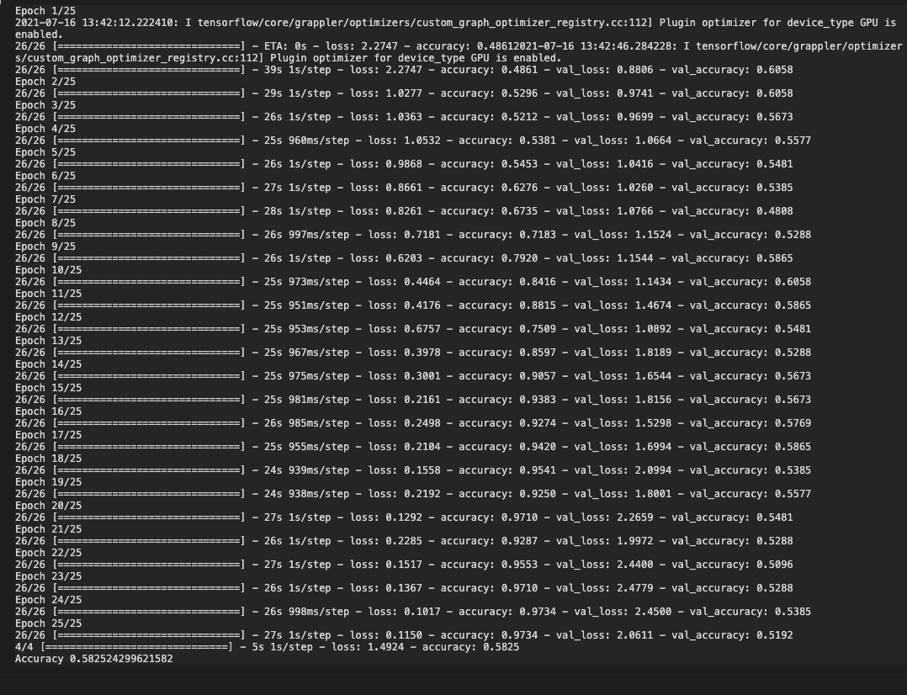
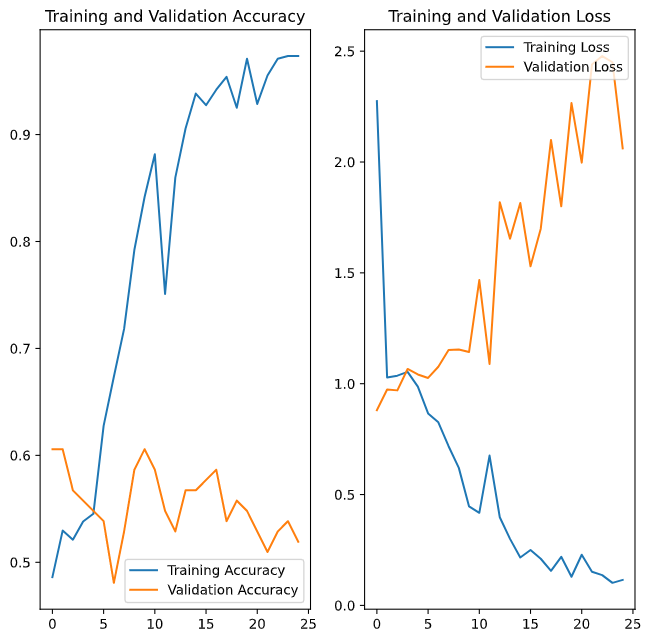
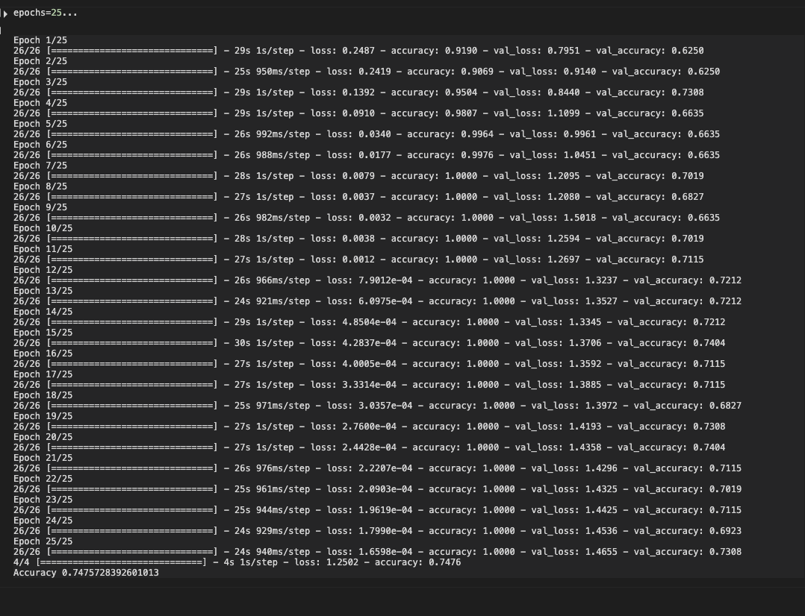
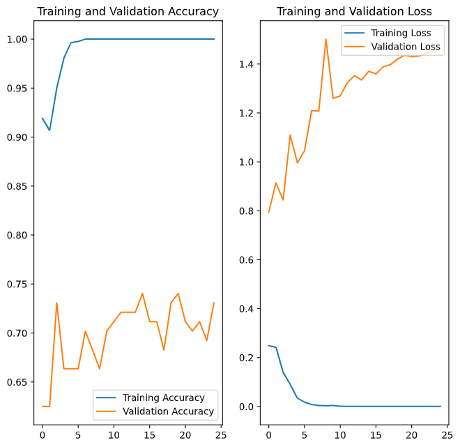
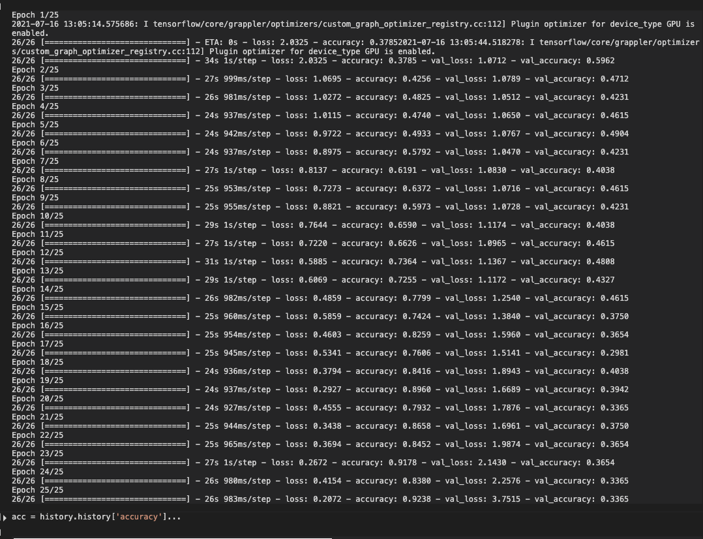
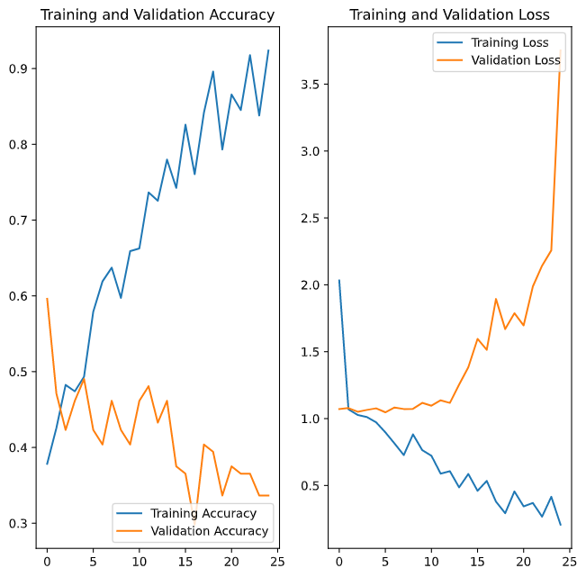

# Thursday 

For today, we fit two datasets into an image classification algorithm. I ran into a lot of difficulties around getting the dataset working, but eventually I was able to get it working. All models were run to 25 epochs.

## Beans

#### Base Model 

  
  

After training the beans dataset, I was able to reach an accuracy on the training data of .97 and an accuracy on the validation data of around .58, with the final epoch being .51. As you can see on the graph, the validation loss is actually best at  the beginning, and slowly gets worse over time. The validation accuracy is similar but less dramatic. The highly accurate training set leads me to believe that the model quickly became overfit. 

#### Augmented Model

  
  

Next I applied image augmentation to the dataset. The data did get considerably more accurate, with a val accuracy of .74. I did 26 epochs, with each one lasting around 25s. Most of those epochs were not really necessary, however, as this model very quickly had an accuracy of 1.0 on the training data and was overfit. The loss function on the validation data only ever increased, with the accuracy evening out after a few epochs. This definitely improved the accuracy of the validation data, however. The augments I used resized and rescaled the images, randomly cropped them, and randomly changed the brightness. 

#### Augmented with dropout

  
  

## Image Augmentation: 

### Beans 

By itself, image augmentation gave us the following res