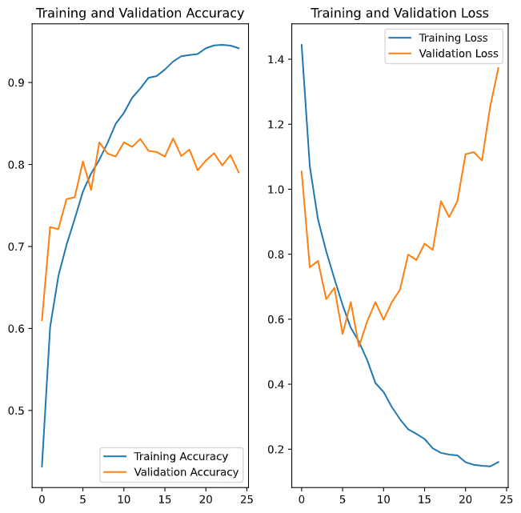

# Thursday 

For today, we fit two datasets into an image classification algorithm. I ran into a lot of difficulties around getting the dataset working, but eventually I was able to get it working. All models were run to 25 epochs.

## Beans

#### Base Model 


<p align="middle">
  
  
</p>

After training the beans dataset, I was able to reach an accuracy on the training data of .97 and an accuracy on the validation data of around .58, with the final epoch being .51. As you can see on the graph, the validation loss is actually best at  the beginning, and slowly gets worse over time. The validation accuracy is similar but less dramatic. The highly accurate training set leads me to believe that the model quickly became overfit. 

#### Augmented Model

<p align="middle">
  
  
</p>

Next I applied image augmentation to the dataset. The data did get considerably more accurate, with a val accuracy of .74. I did 26 epochs, with each one lasting around 25s. Most of those epochs were not really necessary, however, as this model very quickly had an accuracy of 1.0 on the training data and was overfit. The loss function on the validation data only ever increased, with the accuracy evening out after a few epochs. This definitely improved the accuracy of the validation data, however. The augments I used resized and rescaled the images, randomly cropped them, and randomly changed the brightness. 

#### Augmented with dropout

<p align="middle">
  
  
</p>

I also decided to try to model it with ```layers.Dropout(0,2)``` enabled, as we have used that to decrease overfitting before. On one hand, this definitely incresed the time it took for the training accuracy to increase, taking all 25 epochs to even reach 90%, it didn't help much with the validation accuracy. In fact, it hurt it immensely, with only an accuracy of .33 at the end. I have no idea why this would happen, but dropout was definitely a bad influence on the model overall. 


## Eurosat

#### Base Model

<p align="middle">
  
  
</p>

The base eurosat model worked quite well. I ran I was able to eventually achive a training accuracy of .98 and ran it for 25 epochs. The validation accuracy steadily increased for the first 10 epochs or so, and then stagnated at around .85. In the loss, the validation decreased for around the first 10 before slowly rising again. This result is very good, even if there is some degree of overfitting.  

#### Augmented Model


<p align="middle">
  
  
</p>


For this model, augmenting the model didn't actually improve all that much. It actually decreased the top accuracy a bit, and made the loss in the validation rise quite a bit faster after around 7 epochs. I'm not sure if theres much of an advantage to this, I augmented the same way I did for the beans dataset

#### Augmented with dropout

<p align="middle">
  
  
</p>

I also added dropout to the augmented model to see what would happen. The results are overall quite similar, but it took quite a bit longer to train the training data and the two took longer to diverge. It brought up the accuracy from the base augmented model, but it was similar in accuracy to the non augmented model. 