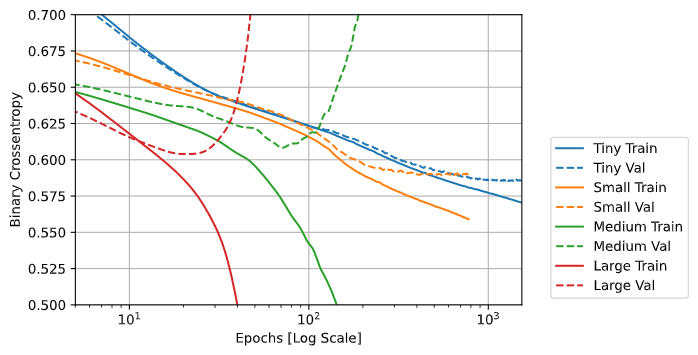
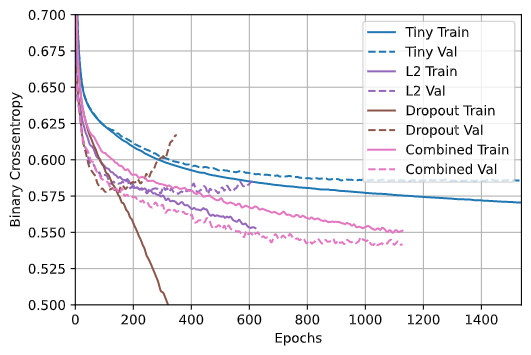

# Higgs Dataset

## Describe the dataset

* The first 21 features are kinematic properties measured by the particle detects in a particle accelerator. The last 7 are functions of the first 21 representing high level features 
* There are 11 million observations 
* we use first 1000 for validation, next 10,000 for training 

## Performance of models 

The large model performed the worst. It very quickly became overfit and split with the validation model. The medium model lasted longer and was more accurate, but also did similarly. The small model did quite well, it diverged near the end but for the most part matched up quite welll with the training data. The tiny model was similar, you can't see all the epochs on the graph but it eventually actually reached a better value than the small, and diverged very little. 

The smaller models performed better because the larger models allowed for them to overfit the dataset much more easily. It matched the training data too well, and was coding for the specific noise of said data instead of the trend. 

## Overfit correction

These show different models with different ways of preventing overfitting. The worst model was without any adjustment. Just dropout improved things for certain, but still had many of the flaws of the large model, and didn't resist overfitting for long. Just L2 performed similarly, but was resistent much longer. The combined model was the best by far, resisting for the whole time and having the bess val_loss result. 

An overfit model is a model that is fit too specifically to exact training data, capturing the noise in the data in a way where when applied to new data with different noise, it is inaccurate. The have had four ways of addressing this so far:

* Use a simpler model: It is less specific and lasts longer without overfitting, but it can also mean you have have a less accurate model. 
* L1 regularization: This makes the cost of the model proportional to the absolute value of the coefficient of the weights, encouraging a sparse model
* L2 regularization: This makes the cost proportional to the square of the value of the coefficient of the weights. This helps because it lowers the cost of small weights while discouraging big ones, allowing a less sparse model. 
* Dropout: This zeros out a number of output features for every layer at random. This works because it means individual nodes cannot rely on the output of others, but must output features that are useful on their own

