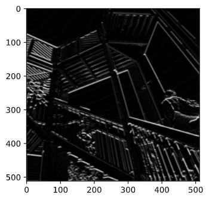
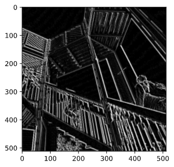
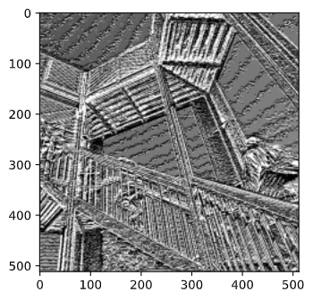
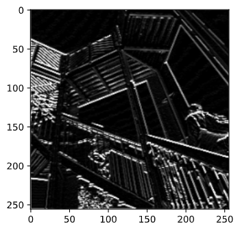

 

# Convolutions and Pooling

## Convolutions

First run



```python
filter = [ [-2, 0, 2], [-1,0,1], [-2, 0, 2]]

```

 I chose this filter because it used relatively small numbers and I wanted to see the effects of leaving the middle values at zero. It seems to make the vertical lines more pronounced, which makes sense given as the filter passes a lower value through the middle of the 3x3. 

### Second Run 




```python
filter = [ [-10, 5, 5], [15, -5, 3], [-7, -4, -2]]
```

For the secon run I did a lot of just random, but larger values. It seems to have turned the entire image extremely dark and the vertical lines are VERY bright. Not sure if this is a result of the large numbers though, as the difference in the middle of the 3x3 is less than in the first run. 

### Third Run



```python
filter = [ [500, -500, 4], [100, -4, -50], [-40, 1, -10]]
```

For this one I went even crazier and just did a bunch of very large numbers. It seemed to try and get a lot of detail from the image, even the sky has waves. Is a very strong transformation. 


### What am I accomplishing? 

These transformations are filtered over every pixel and used to map the strength of the feature (eg vertical lines) in the image. These are used for image classifications to find easily identifiable features for an ML model to find in new images, as it can look for what features are most visible and most common. 

### Pooling



Pooling iterated over the first image from earlier. It looked over every 2x2 set of pixels and took the largest value. The end result is making an image 1/4th the size that accenuates the strongest features. 

### 9x9 --> 3x3 

| 0    | 3    | 0    |
| ---- | ---- | ---- |
| 1    | 3    | 1    |
| 0    | 3    | 0    |

Not sure how to represent the math on here, but thats the end result in table form. 