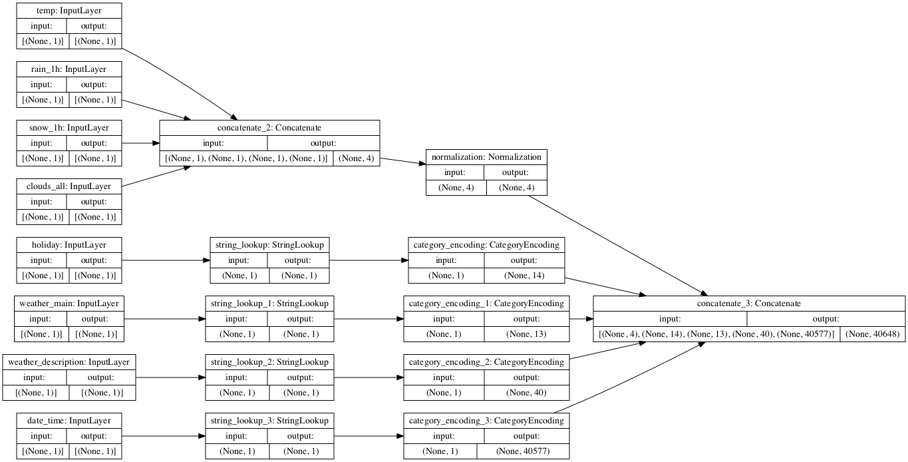
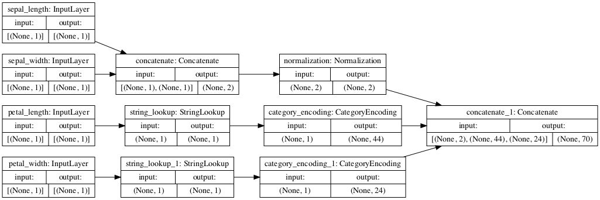
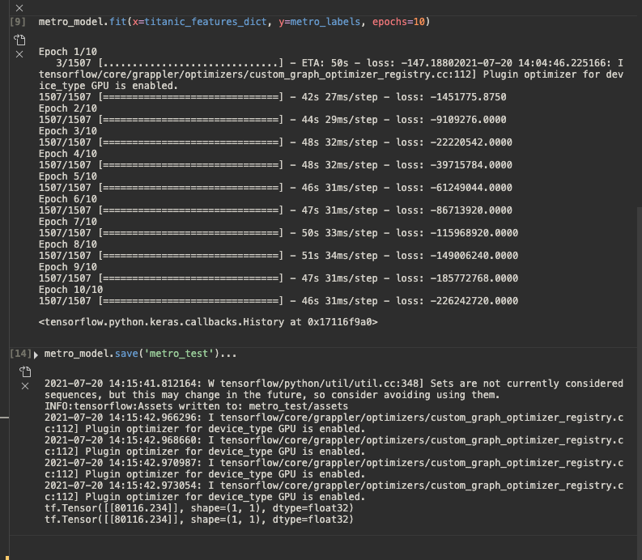
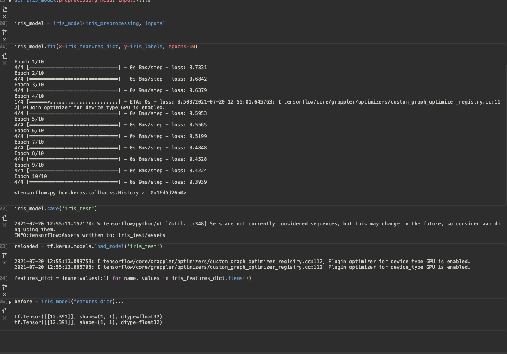

## Metro and Iris Datasets

### Metro Preprocessing 

The Model above is the model for the Metro dataset. The first layer is all of the inputs from the dataframe. From that, it follows two different general paths. First, all the of the numeric values get concatenated together into one box. That concatenated output is put into a normalizaiton function before being sent to the final concatenate. All of the string inputs get put through separate string lookup functions, which maps strings to an integer indecies. From there, it is put through a category incoding function that convertes the indexes into data that the model can process. 

### Iris Preprocessing

The image above is the path for the Iris dataset. It is pretty similar to how the previous dataset works, which is quite confusing to me. For some reason, it considers sepal_length and sepal_width to be numeric values, but petal_length and petal_width to be strings. I am not sure why this happens, and was not able to make it do otherwise. But after that, it follows a similar path to before, using StringLookup and CategoryEncoding for the strings, and concatenating the numeric values and then normalizing them. Then it concatenates all the data before final processing. 

### Metro Results

Here are my results for the metro dataset. The model output used binary crossentropy to for the loss function. The Loss function was already quite low to begin with, but decreased to an incredibly low value of -226242720 by the end of the model. I think this model must be quite complicated, because even with GPU acceleration it took quite a while to complete, compared to the Iris dataset which took a few seconds. To assess the accuracy you would need to check this against the actual results or preferrably create a validation model. 

### Iris Results

Here is the model I made for the Iris dataset. The model output used binary crossentropy to for the loss function. It manages to pready steadily decrease from a start of 0.7 to an end of .39. If you wanted to test this data, you would probably need to compare it against the actual labels or create a separate validation dataset to run the model against. I am not using a different model for each one. I tried to use tf.losses.MeanSquaredError() for this dataset, but it produced a higher loss function so I decided not to. 

