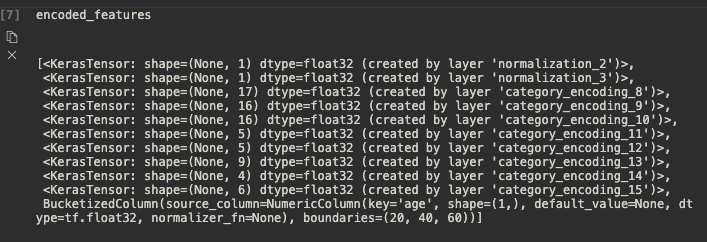
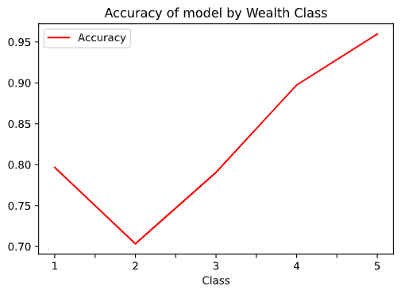
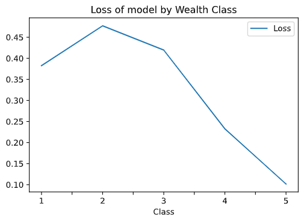

# Country Persons Dataset

## Importing into environment 

For this dataset we dropped hhid, pnmbr, unit, and weights. While these could be promising in the future, they don't fit into our model well currently. We then did a training/testing split to the data. The main features we will be working with are the following

```python
['location', 'size', 'potable', 'toilet', 'electric', 'car', 'cook','gender', 'age', 'education'],
```

## Category Encoding

After a normalization layer, we started to encode the data. First off, we put `size` and `age` in as a numeric feature. We were going to bucketize age, but for some reason TensorFlow didn't like the format we used, giving us the following error: 

```python
TypeError: 'NoneType' object is not subscriptable
```

I looked into this further, and I think it is because it does not appear as a KerasTensor in `encoded` features. I am unsure how to fix this error, so for now it is a numeric encoding.



 The rest of the features are encoded as categorical columns, of two varities. `['location', 'potable', 'toilet', 'electric', 'car', 'cook', 'gender']` were encoded as categorical string columns, while `education` was encoded as a integer categorical feature. Gender was going to be a categorical feature, but we added the following line to turn it from `[1,2]` to` ['male', 'female']`, allowing us to put it in as a categorical string. 

## Training and results

We used the default keras model from the animals dataset example to train the model. We ran it once for each wealth class and graphed the following losses/accuracy. 


| Class | Loss     | Accuracy |
| ----- | -------- | -------- |
| 1     | 0.382679 | 0.796661 |
| 2     | 0.477249 | 0.703443 |
| 3     | 0.419507 | 0.790543 |
| 4     | 0.232645 | 0.897242 |
| 5     | 0.101581 | 0.959560 |





The loss and accuracy graphs are pretty similar, just obviously reversed. Strangely, the lowest class is more accurate than class 2, but class 3 is similar to class 1 and , 4 and 5 and both much more accuarate. Class 5 is definitely the most accurate, reaching 95% accuracy, but all of the accuracies are relatively good, with none dropping below 70%. 

## Possible explanations 

Similar to [yesterday's model](wed3.md), each class has a different number of people in it. We got the data on this by doing the following:

```python
for x in range(1,6): print(len(dataframe[dataframe['wealth'] == x]), 'in', x)

14837 in 1
12743 in 2
10106 in 3
6028 in 4
4505 in 5
```

This is basically the opposite trend as yesterday. In the city, most people were in the higher income brackets, and those higher income brackets had the lowest accuracy. In the country model, there are far more people in the lower ones, and the lowest ones had the lowest accuracy. This is an interesting observation, although it doesn't explain why 1 is more accurate than 2, even though 1 has more people. I'm not sure the exact cause of this, but it would be interesting to investigate. 


## Predicting new data

So for this I pretty much made up a person with the following values: 

```python
sample = {
    'location': 'Maryland',
    'size': 9,
    'potable': 'Protected Well',
    'toilet': 'Flush to septic tank',
    'electric': 'Yes',
    'car': 'No',
    'cook': 'Wood',
    'gender': 'female',
    'age': 50,
    'education': 3,
}
```

I then put them through the model once for each class and added the values to a dataframe. The results were below, with "Percent" meaning the percent chance of being in each class, according to the model. 

| Class | Percent |
| ----- | ------- |
| 1     | 99.8    |
| 2     | 99.4    |
| 3     | 99.6    |
| 4     | 89.3    |
| 5     | 10.8    |

Not sure what to think of this. Is a very strange result, so I assume one of the values I put in has a high correlation for not being in class 5, but the rest seem to be very applicable in all other cases. A model which classifies them by class instead of splitting up the classes before the model would probably be more useful in this example. 