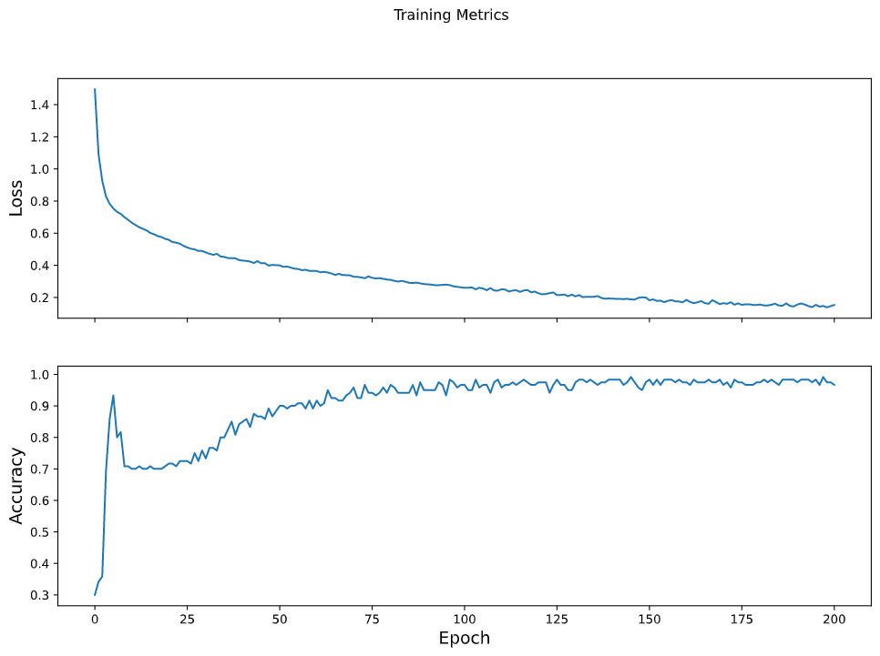
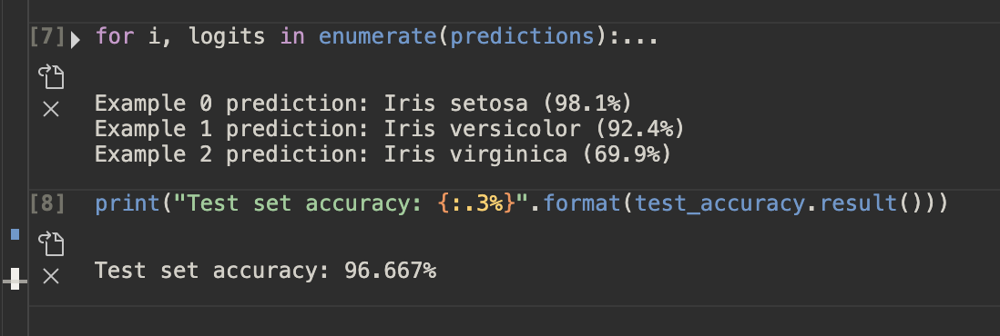

# Writeup

## Dataset 

For the custom training model, we used the familiar iris dataset. This dataset is a set of measurements of three different flowers (setosa, virginica, and versicolor). It measures sepal width and length, and petal width and length. We've used this dataset several times before. There are 120 total examples, and each example has four features and one of three possible label names. 

## Creating tf.dataset

I used TensorFlow's make_csv_dataset command to create the tensorflow dataset. This command is used because it is parsing a CSV formatted file. It loads the csv into a format usable for tensorflow, and requires a few parameters to be set. I set batch_size to 32, meaning the set of data used in one iteration of model training will be 32 data points long. I also specified the input data, as read by get_file, and the column/label names. I let tensorflow use the default setting of shuffling the data as well. 

## Model Architecture

Before the model itself, I used tf.stack to pack the features into a single array with the shape (batch size, num_features). The type of model we used is a neural network, or a network of different hidden layers of neurons that take input connections from the previous layers. This model allows for highly complex relationships. The category of neural network used is a dense fully connected neural network. The output of this will be the probability of each type of iris flower. 

To create this model I used the TensorFlow keras API. I created two keras dense layers with 10 nodes each, and an output layer of. 3 nodes (one for each flower). I also specified the input shape of (4,). Each layer used ReLU to create its' output shape of each node. The rules of ReLU are if the input is negative or zero, output is 0, and if input is poisitive, output equals input. The ideal number of layers and neurons depends on the problem and often requires experimentation, but generally more neurons makes a more powerful model, but needs more data to feed it. The functions used in the model are softmax and argmax, with softmax returning the probabilities of reach result, and argmax outputting which it thinks is most likely as the final prediction. 

## Training

For training we gradually optimize the neural network by feeding it data from the training dataset. Over time (depending on number of epochs) the model runs itself over the data and gets better and better at predicting the training dataset each time. This can have issues, however, as you can match it too well, causing overfitting. This happens when it matches the specific randomness of the training sample and picks up the noise instead of the underlying trend, making it an inaccurate model for a different set of testing data. 

Training gets better by trying to minimize the loss function, eg whatever mathematical function you set to "grade" the model. This model used "sparse categorical crossentropy", which calculates the average losses across the examples. For an optimizer, I used stochastic gradient descent, basically it adjusts parameters to slowly move in the direction towards a local minima that reduces the loss function. 

The loop inside each epoch is as follows. First, it iterates over each example in the dataset and grabs its features/label. With that, it makes a prediction using the neural network and compares it with the label. It measures the inaccuracy of said prediction and calculates the loss/gradients. It then uses the optimizer to tweak the models variables, records some stats, and then repeats into the next epoch. For this we had 201 epochs. 

## Training Results



This graph represents the 201 epochs and the loss/accuracy statistics over time. As you can see, the loss slowly goes town and then begins to flatten out. The accuracy spikes a bit at first, and then slowly improves until it begins to flatten out. This is a sign that the accuracy won't improve much from doing more epochs as it is pretty steady. 

Against the test dataset, this was 96.6% accurate. This is an extremely good result, especially for the test dataset. The test dataset just used the model without changing it on the input data from the test dataset and used argmax() to give a prediction, and then graded the accuracy of the predictions. 

## Predictions

I used the following dataset to test its predictions on numbers I totally made up: 

```python
predict_dataset = tf.convert_to_tensor([
    [6.1, 4.3, 2.3, 1.4,],
    [4.9, 3.5, 4.6, 0.6,],
    [3.2, 5.1, 6.3, 1.1]
])
```

So each [] is the features for one made up flower. 

```
Example 0 prediction: Iris setosa (93.9%)
Example 1 prediction: Iris versicolor (94.7%)
Example 2 prediction: Iris virginica (93.5%)
```

So for the first one it is 93.9% sure it is a setosa, for the second it is 94.7% ure it is a versicolor, and for the third it is 93.5% sure it is a virginica. Interesting that it was so sure with the random numbers I made up. 