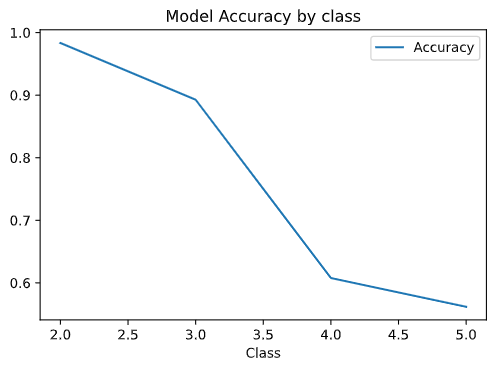

# Classify Structured Data

## Importing into environment 

This step was pretty simple, simply commented out the teras get_file lines and changed csv_file to point to city_persons.csv

## Testing and validating the model 

For the features in the data, we mostly left them the same and simply used numeric_column to add size, education, and gender. These were already formatted pretty well for the model and didn't require chaning much. For age, we used set up age buckets of 20yrs, 40yrs, 60yrs. 

## Results 

| Class | Accuracy |
| ----- | -------- |
| 2     | 0.983415 |
| 3     | 0.892683 |
| 4     | 0.607805 |
| 5     | 0.561951 |

The results are interesting(forgive the wierdly formatted graph). For Wealth class 2 it is extremely accurate at .98. From then, the accuracy decreases a bit in 3 and then drops off a cliff for 4 and 5. My Hypothesis for this is that if you look at the dataframe, there are very few people in class 2 or class 3, and a lot in 4 and 5. Its possible the people from that group are more homogenous or very similar and therefore the model performed well on them. This is confusing though, since a test/train split was applied so it doesn't seem to be overfitting. I'm not really sure what happened, but the trend is intersting to observe. 