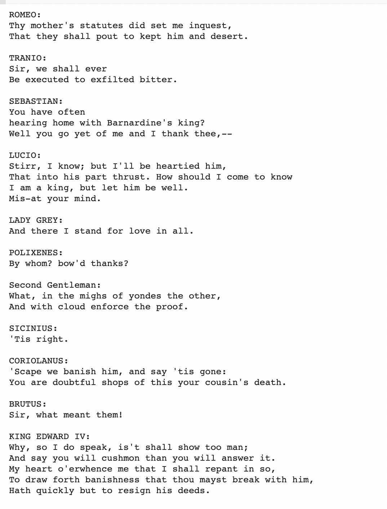
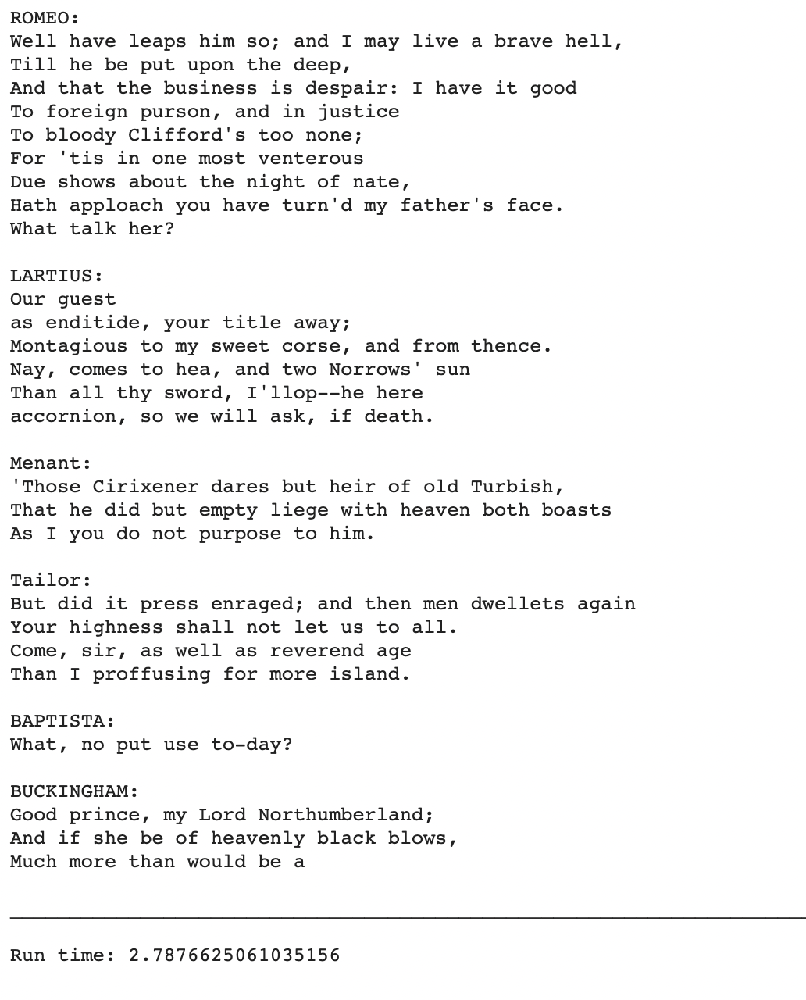

# Text generation with RNN

Above is the final generated text. I used 50 epochs to generate this, and it comes out quite well. It sounds like something from shakespeare! 

## How was it produced? 

### Processing, Vectorizing, and Predicting Text

* First, I converted each character into a numeric ID. 
  * Using `preprocessing.StringLookup` I converted them into character IDs. 
* To Predict the text, I divded the text into example sequences 
  * This takes individual character IDs into sequences of a various size. 
  * Prepare for model by shuffling data and packing into batches 

### Building model 

Model has three layers: 

* `tf.keras.layers.Embedding` 
  * Input layer, maps character IDs to a vector
* `tf.keras.layers.GRU`
  * A type of RNN

* `tf.keras.layers.Dense`
  * Output layer. outputs the log likelihood of each character according to the model 

### Training the model 

I used 50 epochs when training. It got down to a loss of .43 from an initial loss of 1.64. I tried it with less epochs, but decided to let it go for a while after to improve the results. 

### Generating Text

To generate text, it calls the model with some text and an internal state, and it returns the prediciton for the next character along with the new internal state. This loop repeats itself to generate more and more characters of text. 

### Customized training

I setup a custom training loop as well, it calculate updates and applies them to the model using an optimizer. Here is the result after 50 epochs: 

