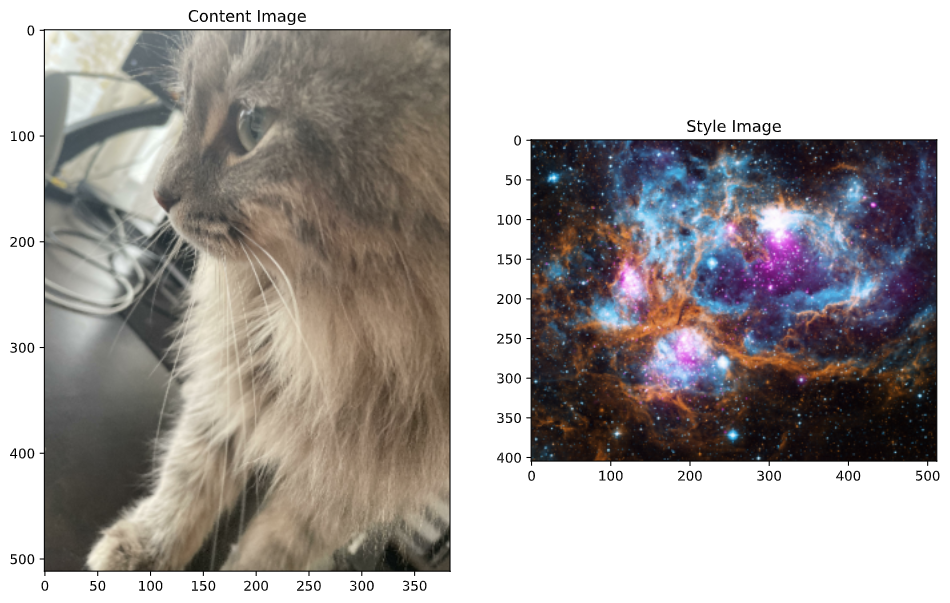

# Transforming Images

### Image 1: My dog and Landscape with black figure by Amadeo de Souza-Cardoso

Here are the two sources images. I chose the first because it is a picture of my dog, buddy. It is a picture I took about a year ago of him wearing my dad's glasses, and it is one of my favorite pictures. I mixed it with the second image because I really liked the style of it, and thought buddy would look funny with that style applied. Here is the result: 

I really like the result. He looks almost surreal, enjoying the cityscape. All he needs now is to be holding up a newpaper and coffee and he will fit right in. I really like the resulting image, the top left has some weird imperfections but everything else I really like. I did 5 epochs of each section, as it seemed to not improve much after a few epochs. 

### Image 2: My cat and space 

The second image I chose was my cat and a picture of space, called "Cosmic Winter Wonderland". This image was from shortly after I had gotten my new cat, Chloe. I know its a bit boring to choose pet images but I think they both really work. I chose an image of space because it seems as though she is staring off into the void, and it would really work well with that. I love this image of her too, so it meant a lot to me. Here is the result: 

This Image isn't perfect, I think it hides the cat a bit much, but it does almost make her look like she is a part of space. It looks really cool. Especially near her feet, it looks like they are just stars instead of cat legs. Overall I think this came out really well. 

### Extra credit: DeepDream

Image 1:

 

This is buddy put through the deep dream thing. It is really trippy and looks super fascinating. 

Image 2: 

Here is it applied to Chloe. It works a little too well though, and you can hardly tell its the same picture. 