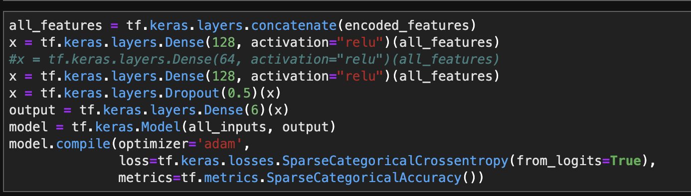

# Estimating American Commute Times using ACS Microdata

## Abstract 

Using data from the US Census Bureau, specficially the 2019 American Community Survey, I will analyze the data and attempt to build a model to predict commute times given other demographic variables. I split commute times into 6 even buckets and used the Keras API and Keras preprocessing layers. For the features, I selected Age, household income, Rent as a percent of income, bedrooms, gas cost and property value as numeric values. I selected multigenerational household, race, sex, units in housing structure, and lot size as categorical values. The best result of the model used two 128 unit Keras dense layers and was able to accurately place the results in the correct bucket (with 6 total buckets) 25% of the time. Models that overfit were able to correctly place the training data up to 40% of the time, but it hurt validation accuracy. The linear correlations between this data are extremely low, with no feature having a correlation above .1, so there appears to be a limit in how accurate these models can be. With more features and processing power this accuracy may be able to be overcome. The lack of correlation is an interesting observation in itself, as it appears that transport time is relatively weakly connected to almost all demographic variables, and is quite similar across the board. 

## The Problem

This project aims to investigate the nature and feature of the American commute. What demographic features predict commute times? Can we accurately predict commute times given these various indicators? How can we use this information to better address policy?

## The Dataset

This project uses the 2019 American Community survey, or ACS. It is a survey done by the Census bureau on approximately 1% of the US population. The Census bureau provides a Public use Microdata Sample, or PUMS. It provides detailed microdata on 4 million respondants and their answers to various variables. 

### Features of the Dataset

There are a total of 510 variables in the PUMS dataset, but I only used a few for this analysis.

| Variable | Description                                    |
| -------- | ---------------------------------------------- |
| JWMNP    | Travel Time to work (Target Variable)          |
| AGEP     | Age                                            |
| HINCP    | Household Income                               |
| GRPIP    | Gross Rent as a percentage of household income |
| BDSP     | Number of Bedrooms                             |
| GASP     | Gas Cost (Monthly)                             |
| VALP     | Property Value                                 |
| RACNUM   | Race (Encoded as number between 1 and 6)       |
| MULTG    | Multigenerational Household (yes/no)           |
| SEX      | Sex                                            |
| BLD      | Units in housing structure                     |
| ACR      | Lot Size                                       |
| SCHL     | Educational Attainment                         |
| VEH      | Number of Vehicles                             |

### Technical Troubles

The dataset was far too large to run on my local machine. It could not load the full dataset into a dataframe without python crashing from overuse of memory. This could be solved by using the official Census PUMS API, as it allows you to specifically only use the variables I need for this project instead of all 510 variables. Unfortunately, the Census API is severely broken and threw out a 500 internal server error for the first few days of the project. Eventually it worked, but this was after I managed to get the full dataset loaded using a Google Cloud VM with 52gb of memory. 

### Loading the Dataset

Eventually, I decided to run this in the cloud instead, as my laptop could not handle it. I set up a remote VM running JupyterLab in Google Cloud with a Tesla T4 GPU and 52gb of memory. It took a long time to setup correctly (many errors as it used a different python version and Pickle version incompatibility issues occurred), but eventually I managed to get it running correctly. I stored the data in a HDF5 Datastore after fully loading the JSON file, as it allowed for much faster loading times. I also bucketized the travel time target variable with pandas qcut and created 6 even categories of travel times. 

## Data Exploration

I first started to explore the dataset using a heatmat of Correlation Coefficients between various variables in the data.

Unfortunately, the correlations with JWMNP, the target variable, are all quite low. The highest linear correlation is household income with .097, with many being far lower. The most correlated variables are Household income, Number of Vehicles, Sex, Multigenerational, and number of bedrooms.

#### Additional Exploration

After the correlation heatmap, I decided to look further into individual variables. 

First off, I created a density map of the target variable. This just shows me the distribution of all the different commute times. In total, it appears the vast majority are clustered well under 50 minute, with the most being below 25. There is a noticable drop around 25, with one big additional spike, and then it slowly levels off. This is interesting since there seems to be relatively small amounts variation between commute times in absolute terms, and there isn't really a clear distinct grouping in the model. In addition, I think the spikes probably are the cause of round number bias, as people filling out a survey are likely to round to the nearest 5 minutes when reporting commute times, creating a spike in density. 

Second, I created a seaborn pairplot and picked out the most useful result, as many of them were not continuous or didn't show much useful information. This chart is the relationship between household income and commute times, which is interesting to observe because of its high correlation. Sadly, it is quite difficult to represent this accurately since the number of data points in this dataset means that its hard to tell the difference in density after it saturates an area with blue. There are still trends observable though, with higher household incomes seeming to create a downwards slope on the graph. There is also another distinct grouping at the higher end of JWMNP, which is quite interesting. 

Third, I created a plot between number of bedrooms and travel time. Interestingly, zero bedrooms creates a quite predicable result, with a pretty tight distribution of pretty low commute times. As bedrooms increase, it travel time seems to increase and become more variable, but it plateaus off pretty quickly. This is interesting, and there is definitely something about having zero bedrooms that makes it correlate so well with lower commute times. Maybe people with no bedrooms are more likely to live in apartments in cities, and therefore closer to their work? Not sure. Would be interesting to look into. 

## Preprocessing

For preprocessing, I eventually used Keras Preprocessing layers. Initially, I used feature_columns but the model gave me lots of issues so I switched

I put the variables into the following categories: 

| Numeric            | Categorical                 |
| ------------------ | --------------------------- |
| Age                | Multigenerational Household |
| Income             | Race                        |
| Rent %             | Sex                         |
| Number of Bedrooms | Units in housing structure  |
| Property Value     | Lot size                    |
|                    |                             |

## Attempt

#### Attempt 1: Failure

The first model I made had the following structure:

The model was initally much more simple, but I increased it over time

The model would quickly plateau at pretty much exactly one value. This value was pretty much exactly the value of random chance. I am guessing the model was so bad that it settled at a local maxima of randomly guessing. I tried running the model as more complex and for longer and longer but for no avail. 

##### Examining the failure

I created the following confusion matrix after using the model to predict outputs on the testing dataset. 

It was a strange result, and seemed to be universally predicting one label, so I looked a bit closer. 

Above is the softmax() predictions the model gave out. They are identical and repeating. The model.predict() funciton literally gave the same exact answer no matter what. So more than just randomly guessing, the model decided to guess one, specific answer. Even with many, many more epochs it wasn't able to predict anything higher. 

### Remaking the Model

At this point, I decided to totally remake the model from scratch. I switched from feature columns to keras preprocessing layers and remade my model using the Keras functional API. 

I made the model quite simple, but I tried making it more dense and it did not improve accuracy. I also switched out the dataset with one using the official Census API, and was able to include both household data and person data, enabling a few more variables. 

The model performed considerable better than before The results slowly improved over time, and I was able to get a validation accuracy of .2572, higher than the random guess of .227. This was still quite a low result though. 

#### Refining the model 

To refine the model, I created a custom training loop, shown below: 

Using this testing data, I was able to get the following results on the training data:

While this is just on the training dataset, this is by far the best accuracy I have seen by a huge margin. Sadly, the testing accuracy was a lot lower at .2311, suggesting this model was simply overfit. The model being overfit meant it actually performed worse than the model not in a custom training loop. Additionally, the validation accuracy actually decreases with time, also suggesting overfitting. Not sure where to go from here

### Final Thoughts

The complexity and size of this model make it very difficult to predict. In addition, the very small linear correlations mean the model is trying to get a lot of information out of a dataset with very little. Adding more features and trying out other types of ML models may improve performance, and could be an area of further study. The size of the dataset also makes it difficult to work with, as it would have a lot of trouble running on machines without GPU acceleration. In terms of other literature on the subject, there is one paper analyzing the 2000 ACS dataset in florida in relation to travel time, but it is just an analysis/overview of the data, and did not try to make a model predicting anything. Would still be valuable to analyze the data more in depth, particularly including users that do not drive cars at all, as that data is omitted due to the methods I used in the data. 

## [Presentation](https://docs.google.com/presentation/d/1D3daSWO6kgrrGgWWUD-U__ZssHlr0__o_0J6_QRzM6c/edit?usp=sharing)

## [Video](https://youtu.be/r5LYVGgI0rc)

